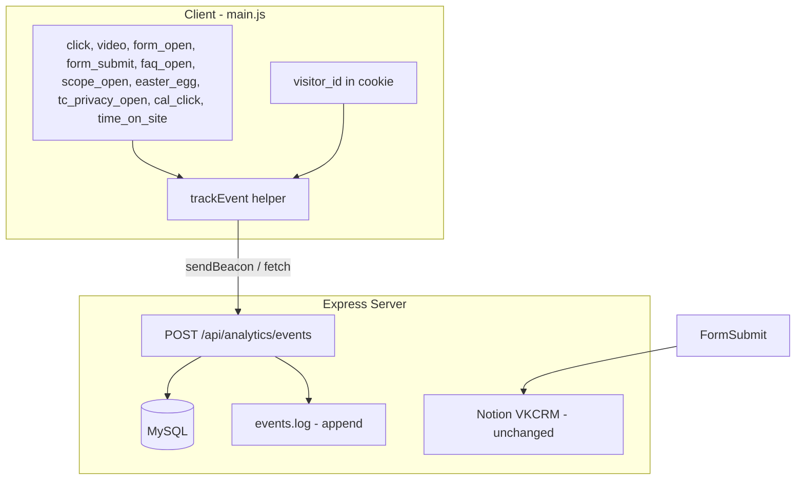

# Analytics Events to MySQL and Server Logging

## Current State

- **Client**: Visitor ID and interaction data (buttons_clicked, videos_watched, past_form_submissions) stored only in cookies; no real-time server send for events
- **Server**: Express with form handlers (`/book-a-call`, `/website-review`, `/lead`); submissions go to Notion VKCRM + Mailchimp; `logs/submissions.log` for form submissions only
- **Existing plan**: [vk_portable_analytics_layer_96039d12.plan.md](.cursor/plans/vk_portable_analytics_layer_96039d12.plan.md) describes a full analytics layer but is not yet implemented

## Architecture Overview

---

## 1. Database Schema (MySQL)

**visitors** (one row per visitor_id):

| Column        | Type         | Notes                        |
| ------------- | ------------ | ---------------------------- |
| id            | BIGINT PK    | Auto-increment               |
| visitor_id    | VARCHAR(64)  | Cookie ID (UNIQUE)           |
| first_seen_at | DATETIME     | First event                  |
| last_seen_at  | DATETIME     | Last event                   |
| referrer      | VARCHAR(512) | First page referrer          |
| utm_source    | VARCHAR(128) | From first page              |
| utm_medium    | VARCHAR(128) |                              |
| utm_campaign  | VARCHAR(256) |                              |
| utm_term      | VARCHAR(256) |                              |
| utm_content   | VARCHAR(256) |                              |
| email         | VARCHAR(255) | Enriched when form submitted |
| name          | VARCHAR(255) | Enriched when form submitted |
| enriched_at   | DATETIME     | When email/name added        |

**events** (one row per event):

| Column       | Type         | Notes                      |
| ------------ | ------------ | -------------------------- |
| id           | BIGINT PK    | Auto-increment             |
| visitor_id   | VARCHAR(64)  | From cookie                |
| event_type   | VARCHAR(64)  | See event types below      |
| occurred_at  | DATETIME     | Client timestamp           |
| page_url     | VARCHAR(512) | current_url                |
| referrer     | VARCHAR(512) | document.referrer          |
| utm_source   | VARCHAR(128) |                            |
| utm_medium   | VARCHAR(128) |                            |
| utm_campaign | VARCHAR(256) |                            |
| utm_term     | VARCHAR(256) |                            |
| utm_content  | VARCHAR(256) |                            |
| metadata     | JSON         | Event-specific (see below) |

**Event types** (allowlist on server):

- `click` – button/CTA click (metadata: `button_id`, `modal_panel`)
- `video_play`, `video_pause`, `video_ended`, `video_progress` (metadata: `video_label`, `pct`)
- `form_open` (metadata: `form_id`, `trigger` – button/url/exit_intent/inactivity)
- `form_submit` (metadata: `form_id`, `has_email` – true when email captured)
- `faq_open` (metadata: `faq_question` or `faq_index`, `trigger` – click/linger)
- `scope_open` (metadata: `scope_item_id`, `scope_item_label`, `trigger` – click/linger)
- `easter_egg_star` (metadata: `star_name` – when placeholder star shown)
- `tc_open`, `privacy_open` – T&C / Privacy Policy opened
- `cal_link_click` – calendar booking link clicked (metadata: `source` – modal/footer/mobile)
- `time_on_site` – heartbeat (metadata: `seconds`)

---

## 2. Client-Side: Central `trackEvent` and Immediate Send

**Approach**: Add a lightweight `trackEvent(type, metadata)` in [main.js](main.js) that:

- Uses existing `visitor_id` from cookie (only if consent accepted; otherwise skip or use session-only)
- Collects UTM + referrer from `window.location` and `document.referrer`
- Sends **immediately** via `navigator.sendBeacon` (preferred) or `fetch` with `keepalive: true` so it doesn’t block navigation
- Fires **asynchronously**; no `await` so UI never waits

**Performance**: Events are fire-and-forget; `sendBeacon` is non-blocking and survives page unload.

---

## 3. Instrumentation Points in main.js

| Event             | Where to call `trackEvent`                                                                                              |
| ----------------- | ----------------------------------------------------------------------------------------------------------------------- |
| `click`           | Existing `recordButtonClick` – also call `trackEvent('click', {...})`                                                   |
| `video`_*         | Existing `recordVideoEvent` / `recordVideoProgressMax` – also call `trackEvent`                                         |
| `form_open`       | `openAppModal` – when panel opens, call `trackEvent('form_open', { form_id: panelId, trigger: lastModalTriggerType })`  |
| `form_submit`     | Each form submit handler – call `trackEvent('form_submit', { form_id, has_email: true })`                               |
| `faq_open`        | FAQ click handler + linger callback – call `trackEvent('faq_open', { faq_question, trigger: 'click'                     |
| `scope_open`      | Pricing feature toggle (click + linger) – call `trackEvent('scope_open', { scope_item_id, scope_item_label, trigger })` |
| `easter_egg_star` | `applyRandomStarPlaceholders` – call `trackEvent('easter_egg_star', { star_name })`                                     |
| `tc_open`         | `openAppModal('terms-and-conditions')` – call `trackEvent`                                                              |
| `privacy_open`    | `openAppModal('privacy-policy')` – call `trackEvent`                                                                    |
| `cal_link_click`  | `app-modal-calendar-link`, `footer-calendar-link`, `mobile-menu-calendar-link` – add handlers                           |
| `time_on_site`    | Heartbeat every **30 seconds** (see §4)                                                                                 |

**FAQ identification**: Each `.faq` gets a `data-faq-question` (first 80 chars) or index when CMS renders; fallback to index if CMS-loaded.

**Scope items**: Use `button.id` (e.g. `feature-btn-1`) and button text as label.

---

## 4. Time on Site

**Recommendation**: Send a `time_on_site` event every **30 seconds** while the page is active.

- Use `setInterval(30_000)`; clear on `visibilitychange` (hidden) to avoid background timers
- On `visibilitychange` (hidden) and `beforeunload`, send a final event with total seconds via `sendBeacon`
- 30s is a good balance: accurate enough for engagement, low request volume

---

## 5. Server API

**POST /vk2026/api/analytics/events**

- Body: `{ visitor_id, events: [{ event_type, timestamp, page_url, referrer, utm_*, metadata }] }`
- Accept single event or small batch (e.g. up to 5) for heartbeats + unload
- Validate `event_type` against allowlist
- Insert into `events`; upsert/update `visitors` (last_seen_at, first_seen if new)
- Append one NDJSON line per event to `logs/events.log` for `tail -f`
- Return 204 quickly; no blocking

---

## 6. Enrichment on Form Submit

When a form with email is submitted:

1. Existing flow: form POST → Notion + Mailchimp (unchanged)
2. New: call `PATCH /vk2026/api/analytics/visitors/:visitor_id` or include `enrich: { email, name }` in form handler
3. Server: update `visitors` row for that `visitor_id` with `email`, `name`, `enriched_at`

You can either extend the existing form routes to also update `visitors`, or add a small internal call from the form handler. The `visitor_id` is in `_context` (already sent with submissions).

---

## 7. Text File Logging

- Path: `logs/events.log`
- Format: NDJSON, one line per event:  
`{"ts":"...","visitor_id":"...","event_type":"...","metadata":{...},...}\n`
- Ensure `logs/` exists; append on each event write
- `tail -f logs/events.log` for live monitoring

---

## 8. Files to Create/Modify

| File                             | Action                                                              |
| -------------------------------- | ------------------------------------------------------------------- |
| `server/db/schema.sql`           | Create – MySQL schema for `visitors`, `events`                      |
| `server/lib/analytics-db.js`     | Create – MySQL connection, insert events, upsert visitors           |
| `server/routes/analytics.js`     | Create – POST /analytics/events, PATCH /visitors/:id for enrichment |
| `server/lib/analytics-logger.js` | Create – append to `logs/events.log`                                |
| `server/config.js`               | Add `DB_HOST`, `DB_USER`, `DB_PASSWORD`, `DB_NAME`                  |
| `server.js`                      | Mount analytics routes, ensure logs dir                             |
| `main.js`                        | Add `trackEvent`, instrument all event points above                 |
| `index.html`                     | No change (or add `data-faq-`* if needed for CMS FAQs)              |

---

## 9. Performance and UX

- All tracking is fire-and-forget; no `await` on client
- `sendBeacon` for critical events (form submit, unload) so they are not lost
- Heartbeat every 30s; stop when tab hidden
- Rate-limit API (e.g. 120 req/min per IP) to avoid abuse
- Only track if `hasAcceptedCookies()` is true (use existing consent logic)

---

## 10. Notion Flow (Unchanged)

Form submissions continue to POST to existing routes; Notion VKCRM and Mailchimp behaviour stay as-is. `_context` (visitor_id, buttons_clicked, etc.) is already sent; server can optionally augment Notion notes with event summaries from MySQL if desired later.