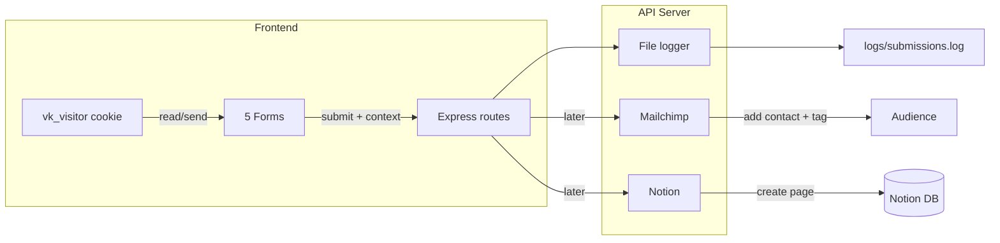

# Form API, cookie tracking, and submission routing

## Current state

- **Site:** Static ([index.html](index.html), [main.js](main.js), [styles.css](styles.css)). No backend; forms already use `fetch()` to `/api/...` which do not exist yet.
- **Forms (5):** All forms use `id="form-{form_name}"` (e.g. `form-book-call`, `form-website-review`, `form-lead-50things`). Submit buttons (and any CTAs that open the modal) use `id="button-{button_name}"`. The payload sent to the API includes **form_id** and **trigger_button_id** so you know not just which form was submitted but which button triggered it.
  - **Book a call** → `POST /api/book-a-call` (name, email, website, message, phone)
  - **Website review (WRV)** → `POST /api/website-review` (name, website, linkedin_url, comments)
  - **Lead magnets** → `POST /api/lead` (email, name, `source`: `lead-50things` | `lead-offboarding` | `lead-socialproof`)

You need one backend that handles these three endpoints, sets/reads a cookie, and routes data: file log, Mailchimp (lead magnets), and Notion (all submissions) in this same build.

---

## 1. Backend choice and layout

**Recommendation: Node + Express** in this repo (e.g. `server/` or root `server.js`). Keeps the stack in JS; we add file logging and HTTP calls to Mailchimp and Notion in this build. No separate database—file log plus Notion as source of truth.

- **Alternative:** Serverless (Vercel/Netlify functions) if you prefer; then logging goes to a store and you'd still call Mailchimp/Notion from the function.

**Proposed layout:**

- `server.js` (or `server/index.js`) – Express app, CORS, cookie parser, route handlers.
- `server/routes/` or inline – `book-a-call`, `website-review`, `lead`.
- `server/lib/logger.js` – append to a text file (e.g. `logs/submissions.log` or dated files).
- `server/lib/cookie-tracker.js` – logic to parse/validate cookie payload and build “context” for each request (see below).
- `server/config.js` or env – `SITE_BASE_URL`, `PORT`, `MAILCHIMP_*`, `NOTION_*` (needed for Mailchimp and Notion in this build).

**Where the API lives (no DNS today):** The API will live on the **same host and path** as the site, so no separate domain is needed. For example:

- **Site:** `http://139.59.113.186/vk2026` (or `http://localhost:3000/vk2026` locally).
- **API:** `http://139.59.113.186/vk2026/api` (same origin).

The Node server will serve static files under `/vk2026` and mount the API under `/vk2026/api`. Frontend uses a **single configurable API base** (e.g. `window.API_BASE = '/vk2026/api'` or `''` if the app is always at the same origin). One place to change when you move to production.

**Configurable site URL:** Keep `SITE_BASE_URL` in env (e.g. `http://139.59.113.186/vk2026` now, `https://vanillakiller.com` later) for logs and future Notion/email links.

---

## 2. Cookie: what to store and send

**Goal:** On each form submit, the API knows: visit count, referring URLs, past form submissions and when, time on site, and anything else useful.

**Approach:** Set a **first-party cookie** (e.g. `vk_visitor`) containing a **signed or opaque visitor ID** plus a **small JSON payload** of client-side metrics. Server decodes/validates and merges with server-side data (e.g. first referrer from first request, IP, user-agent) and logs everything.

**Suggested cookie payload (stored in cookie or in a server-side store keyed by visitor ID):**

- **Visitor ID** – UUID or random string (so you can join multiple submissions).
- **Visit count** – incremented on each visit (or each form load) by client, sent with submit.
- **First referrer** – `document.referrer` on first visit; send once and keep.
- **Last / list of referrers** – e.g. last 5 distinct `document.referrer` values (optional).
- **Form submissions** – client-side list of `{ formId, submittedAt }` for past submits in this cookie’s lifetime (optional; server can also derive “other forms” from DB/log by email or visitor ID later).
- **First visit timestamp** – for “time on site” and recency.
- **Last activity timestamp** – updated on submit (and optionally via a small heartbeat), so “time on site” = last_activity - first_visit (or time since last submit).

**Flow:**

1. **First visit:** No cookie. After **cookie consent** (see below), frontend creates visitor ID, first_visit_ts, referrer, visit_count=1, UTMs, submits array empty. Set cookie (e.g. 1 year, SameSite=Lax, path=/).
2. **Later visits:** Frontend reads cookie, increments visit_count, optionally appends referrer if new, updates last_activity. On form submit, send full context in request body. Server logs it (and can derive truth from its own log/DB).
3. **Time on site:** Client sends `first_visit_ts` and `last_activity_ts` (or `time_on_site_seconds`) with each submit.

**If user declines cookies (graceful degradation):** Do **not** set the tracking cookie. Form submissions still work: send only what’s available without cookie (e.g. `document.referrer` for that request, no visit count, no past submissions). API accepts requests with or without visitor context; logs will show “no consent” or missing context. No errors, no broken forms.

**UTMs and trigger tracking:** Capture **all UTM params** from the URL (e.g. `utm_source`, `utm_medium`, `utm_campaign`, `utm_term`, `utm_content`) and send with every submit. Also capture **which button triggered the form** (see Forms & buttons below) so you know not just which form was submitted but which CTA led to it.

---

## 3. API behaviour (all forms)

- **CORS:** Allow your site origin (and temp URL origin) so AJAX works from both.
- **Body:** JSON. For each endpoint, accept form fields **plus** a **visitor context** object (visitor_id, visit_count, first_visit_ts, last_activity_ts, referrer(s), past_form_submissions, utm_*, current_url, etc.) **plus** `form_id` and `trigger_button_id` (which button opened the modal or submitted).
- **Cookie:** Optionally set or refresh `vk_visitor` from server (e.g. if you generate visitor_id server-side) or leave cookie entirely client-set and only read what’s sent in body/header.
- **Validation:** **Server-side validation** for all required fields, formats (email, URL), and max lengths. Return 400 with `{ error: "..." }` and consistent JSON shape so bad data never reaches logs or Notion.
- **Response:** 200 + `{ message: "..." }` on success; 4xx/5xx + `{ error: "..." }` on failure. Frontend will show **very clear** error/validation messages; success will use a dedicated success screen (see UX below).

**Routing (all in this build):**

- **Every submission:** Enrich payload with visitor context, `SITE_BASE_URL`, timestamp, IP, user-agent. **Log the full payload to a text file** (one line per submission, e.g. NDJSON).
- **Lead magnets** (`/api/lead`): Also call **Mailchimp Marketing API** – add/update contact with a **tag** per lead source (e.g. `lead-50things`, `lead-offboarding`, `lead-socialproof`). You configure inside Mailchimp (automations or segments) so that when someone has that tag, they receive the correct lead-magnet email. No Mailchimp-hosted forms—all via our API.
- **All submissions:** Also sync to your **existing Notion CRM** as the single source of truth. We’ll map form data and tracking into your current DB structure (one DB or several—your choice). File log stays as a backup.

---

## 4. Mailchimp – how it works (this build)

**All by API; no new forms in Mailchimp.** When someone submits a lead form, the API will:

1. Call the **Mailchimp Marketing API** to add or update the contact in your audience.
2. Set **merge fields** (name, etc.) and a **tag** that matches the lead source (e.g. `lead-50things`, `lead-offboarding`, `lead-socialproof`).

You then configure **in Mailchimp** (automations or segments): “When someone is added with tag X, send this email / add to this automation.” So the correct lead-magnet email is sent based on the tag we set via API. You need: API key, server prefix (e.g. `us19`), audience ID. No Mailchimp-hosted forms required.

---

## 5. Notion – plug into your existing CRM (this build)

**You already have a Notion CRM.** We plug into it as the single source of truth. In this build:

- You’ll share the relevant database(s) with a Notion integration and we’ll use the API to create a new page (row) per submission.
- We’ll map form fields and tracking data (form_id, trigger_button_id, visitor context, UTMs, SITE_BASE_URL) to your existing properties (or suggest new columns if needed).
- I’ll walk you through the setup step by step (integration token, sharing the DB, field mapping). Notion has a clear [API](https://developers.notion.com/) and we’ll use it to sync everything there.

---

## 6. Confirmed: security and behaviour

- **Rate limiting** – yes; per IP (and optionally per visitor_id) e.g. 5 submissions per minute.
- **CORS** – yes; restrict to your site origins (temp URL, production, localhost).
- **Honeypot** – add a hidden field; if filled, treat as bot and reject (or log but don’t send to Mailchimp/Notion).
- **Idempotency** – yes; client sends `idempotency_key` (e.g. UUID) per submit; server ignores duplicate keys within a window (e.g. 24h).
- **Single “API base URL” on frontend** – yes; one configurable base for all fetch calls.
- **Server-side validation** – yes (see §3).
- **Cookie consent (UK)** – if you’re in a jurisdiction that requires it, Slim, stylish cookie bar along the bottom with your copy (e.g. "Since tracking conversions is the lifeblood of our work, tracking them makes a lot of sense") and Accept / Decline. Only after Accept do we set the tracking cookie; decline = forms still work, no tracking (graceful degradation).

---

## 6b. Success and error UX

- **Success:** Replace the **entire form area** with an animated, fading-in **success screen** (design TBD – e.g. checkmark, short thank-you message, maybe a CTA). The modal panel content swaps from form to success state so it feels like a clear “you’re done” moment.
- **Errors / validation:** Keep messages **very clear** – which field failed and why (e.g. “Please enter a valid email address”, “This field is required”). Inline next to fields where possible; for API errors, show a clear message in the same area so users know what to fix.

---

## 7. Implementation order

1. **Backend scaffold** – Express, `SITE_BASE_URL` and `PORT`, CORS, cookie parser.
2. **File logger** – one module that appends a line per submission (endpoint, timestamp, full payload including visitor context and URL).
3. **Three routes** – `POST /api/book-a-call`, `POST /api/website-review`, `POST /api/lead`; validate body, attach visitor context (from header or body), add server fields (timestamp, IP, user-agent, `SITE_BASE_URL`), call logger.
4. **Cookie + context on frontend** – create/read `vk_visitor`, maintain visit_count, first/last timestamps, referrer(s), optional past submissions; send this as part of the request body (or a header) on every form submit.
5. **Frontend** – ensure all three fetch calls send visitor context and use a single configurable API base URL (e.g. empty for same-origin, or `https://your-api.com`).
6. **Mailchimp** – add contact + tag for `/api/lead` (env: API key, server prefix, audience ID).
7. **Notion** – create page per submission in your existing CRM (env: integration token, database ID(s)); walk through DB mapping with you.
8. **Cookie bar and success screen** – consent UI and replace-form-with-success UX.

**Node.js – small steps (you’re new to Node):**

- **Step 1:** Install Node.js (from nodejs.org or via your OS package manager). Check with `node -v` and `npm -v`.
- **Step 2:** In the project root, run `npm init -y` to create `package.json`. Then install Express and other deps one at a time, e.g. `npm install express cors cookie-parser dotenv` (and later `express-rate-limit`). We’ll add a short `README` or checklist that lists each command in order.
- **Step 3:** Create `.env` from `.env.example`, set `SITE_BASE_URL` and `PORT`. Run the server with `node server.js` (or `npm run start`). No database or build step required for phase 1.
- **Step 4:** Serve static files from a folder (e.g. `public/` or the repo root) under the path `/vk2026`, and mount API routes under `/vk2026/api`, so one server handles both site and API. We’ll wire this in the code and document the exact URLs to open in the browser.
- **Step 5:** Test each form against `http://localhost:PORT/vk2026` and confirm submissions hit the API and appear in the log file. Then point the same setup at your temp URL (e.g. `http://139.59.113.186/vk2026`) when deploying.

---

## 8. Later: form opens, scrolls, real-time behaviour

**Yes, we can add this later.** The design can support an optional **behaviour/events** endpoint (e.g. `POST /api/events` or `/api/track`) where the frontend sends:

- Modal opened (with `form_id` or panel id).
- Scroll depth (e.g. 25%, 50%, 75%, 100%).
- Time on section or other engagement signals.

Each event can include the same `visitor_id` (from the cookie, if consent given) so you can join behaviour to submissions. No need to build it in phase 1; we’ll keep the visitor context and API structure such that adding this later is straightforward.

---

## 9. Summary diagram

---

## 10. Files to add/change (concrete)

- **New:** `server.js` or `server/index.js` – Express app, static at `/vk2026`, API at `/vk2026/api`, config (`SITE_BASE_URL`, `PORT`), rate limit, CORS, honeypot check, idempotency.
- **New:** `server/lib/logger.js` – append NDJSON to `logs/submissions.log`.
- **New:** `server/routes/submissions.js` (or equivalent) – handlers for book-a-call, website-review, lead; read visitor context, form_id, trigger_button_id; validate; log; later Mailchimp/Notion.
- **New:** `server/config.js` – read `process.env.SITE_BASE_URL`, `PORT`, allowed origins; validate for run.
- **New:** `.env.example` – `SITE_BASE_URL=http://139.59.113.186/vk2026`, `PORT=3000`, placeholders for Mailchimp/Notion.
- **Update:** [index.html](index.html) – ensure every form has `id="form-{form_name}"`, every submit and modal-trigger button has `id="button-{button_name}"`; add honeypot field per form; add cookie consent bar (slim, bottom); add markup for success screen (per panel, design TBD).
- **Update:** [main.js](main.js) – cookie consent (only set tracking cookie after Accept); visitor context (with UTMs, trigger_button_id) sent with each submit; single `API_BASE` (e.g. `/vk2026/api`); idempotency_key per submit; on success replace form with animated success view; on error show very clear messages.

This gives you one API handling all forms, a cookie-driven visitor story, text-file logging, Mailchimp (lead magnets by tag), and Notion (all submissions) in one build today.