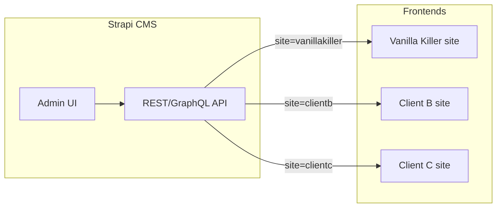

# Strapi CMS for vk2026 – Content & settings from a headless CMS

---

## Answers to your questions

### 1) Is Strapi open source? Does it run on my server and store data in my DB?

**Yes.** Strapi is open source (MIT licence), runs entirely on your own server, and stores data in your own database. You choose the database: **SQLite** (easiest for local/dev), **PostgreSQL**, **MySQL**, or **MariaDB**. There is no vendor lock-in or required cloud service. You can self-host on any VPS, Railway, Render, DigitalOcean, etc.

### 2) YAML / schema-as-code – can you define the structure and Strapi ingest it?

**Partly.** Strapi does **not** use YAML or a separate “import” step. It uses **JSON schema files** (`schema.json`) stored in specific folders. When Strapi starts, it reads these files and builds the content types – there’s no “ingestion” UI; the schema files **are** the definition.

**What we can do:** Provide a **complete blueprint** with:

- **Exact `schema.json` files** for each content type, ready to place in `cms/src/api/...` so Strapi loads them on boot.
- **Field names, types, validations**, and a **separate help-text document** (Strapi does not support field-level help text in schema, but you can keep a doc for editors or use `info.description` for content types).

So yes: you get a full set of instructions (schema + folder structure + field mapping) that define the CMS. You create the `cms` project, drop in the schema files, run Strapi, and the admin panel is ready. No clicking through the Content-Type Builder to recreate everything.

### 3) CMS location – /cms inside vk2026

**Decided:** Strapi lives in `vk2026/cms/`. Multi-site / future clients are out of scope for now.

## What is Strapi (in plain terms)

**Strapi** is a **headless CMS**: it gives you an admin panel (like WordPress’s backend) where you edit content and settings, but instead of rendering HTML it exposes that data via a **REST or GraphQL API**. Your existing frontend (this repo’s `index.html` + `main.js`) stays as the “head”; it just **fetches** content and settings from Strapi and either injects them into the page or uses them to drive behaviour (e.g. modals, lead magnets).

- **You get:** A single place to edit copy, toggles, and lists (FAQs, testimonials, pricing, lead magnets, LinkedIn faces, etc.) without editing `settings.js` or digging through `index.html`.
- **Multi-site:** One Strapi instance can hold content for many client sites. You identify each site (e.g. by a slug or “site key”) and the frontend requests only that site’s data.

---

## How this fits your current setup

| Current source             | What it controls                                                                                                                             | In Strapi                                                                                                      |
| -------------------------- | -------------------------------------------------------------------------------------------------------------------------------------------- | -------------------------------------------------------------------------------------------------------------- |
| [settings.js](settings.js) | Toggles (WRV, book call, pricing, cookie consent, etc.), API base, GA ID, maintenance mode, autodialog, lead-magnet config, `linkedin_faces` | **Global “Site settings”** (single JSON-like structure per site or one global with site selector)              |
| [index.html](index.html)   | Hero headline/lead/CTAs, rescue copy, pricing tiers, FAQs, testimonials, resources, footer, modals                                           | **Collection types** (e.g. FAQ, Testimonial, PricingTier) and/or **Single types** (e.g. Home page) per section |

[main.js](main.js) currently reads `window.SITE_SETTINGS` and uses `getSettings()` everywhere. After migration, the frontend will either:

1. **Fetch settings from Strapi** (e.g. `GET /api/site-settings` or a global) and set `window.SITE_SETTINGS` (or equivalent) before/app with `main.js`, or
2. Load a small **bootstrap script** that fetches settings + key content, then loads `main.js` so behaviour stays the same.

Content that is today **inline in HTML** (FAQs, testimonials, pricing blocks, hero text) will be **fetched from Strapi** and either rendered into placeholder containers (e.g. `#faq-list`, `#hero-headline`) or built into the initial HTML by a small build step or server-side include. For a first phase, “fetch on load and inject with JS” is the simplest and requires no new backend in this repo.

---

## High-level architecture (multi-site in mind)

- **One Strapi project** (one codebase, one admin, one database).
- Each “site” is identified by a **slug** (e.g. `vanillakiller`, `client-b`). Content and settings are either:
  - **Stored per site:** e.g. a “Site” collection and relations (Site → Settings, Site → FAQs, …), or  
  - **Single global with a “current site” dropdown** in the admin and API filters by `site` query param or header (simpler for few sites).
- Your **frontend** (this repo) calls Strapi with `?site=vanillakiller` (or a header) and gets back only that site’s data. Same pattern for other client sites.

---

## Step 1 – Install and run Strapi (beginner-safe)

1. **Create the Strapi project inside vk2026:**
  - `cd /path/to/vk2026`
  - `npx create-strapi-app@latest cms --quickstart`
  - Node 18+ required. This creates `vk2026/cms/`, installs deps, and starts Strapi with SQLite.
2. **First run:** A browser tab opens for the **first-time admin user** (email + password). Create it and log in.
3. **Default URL:** After `npm run develop` (from `cms/`), Strapi is at `http://localhost:1337`. Admin: `http://localhost:1337/admin`.
4. **CORS:** In `cms/config/middlewares.js` (or env), allow your frontend origins (e.g. `http://localhost:3000`, `https://vanillakiller.com`) so the browser can call the API.

---

## Step 2 – Content model (what to create in the admin)

Design so the same structure can serve **this site first**, then other clients with different content.

### A. Site settings (replacing [settings.js](settings.js))

- **Content type:** **Single type** named **Site settings** (or **Global – site settings** if you use Strapi’s “Global” feature; Strapi v4 has “Single” and “Global”).
- **Fields:** Mirror the keys you care about from `SITE_SETTINGS`. Examples:
  - **Boolean:** `wrv_offer`, `book_call_offer`, `lead_magnets_enabled`, `show_pricing`, `cookie_consent_enabled`, `show_email`, `cta_primary_black`, `rescue_section_show_videos`, `maintenance_mode`, `autodialog_to_be_shown_on_exit_intent`
  - **Short text:** `site_env`, `api_base`, `ga_id`, `autodialog_form_to_show`, `default_modal`, `book_call_calendar_url`, `maintenance_message`
  - **Number:** `autodialog_to_be_shown_after_delay_s`
  - **JSON or repeatable component:** `lead_magnets` (array of `{ id, enabled, success_message, mailchimp_tag }`)
  - **Repeatable component:** `linkedin_faces` (e.g. `name`, `role`, `photo` – media or text for filename)

For **multi-site:** either one Single type per site (e.g. “Site settings – Vanilla Killer”) or one Single type “Site settings” plus a **Site** dropdown and store settings in a structure like `{ sites: { vanillakiller: { ... }, clientb: { ... } } }`. The API then returns the slice for the requested site.

### B. Content from [index.html](index.html)

Break the page into **collection types** (lists) and optionally **single types** (one record per “page” or section):

| Content                  | Strapi type                      | Fields (example)                                                                                                   |
| ------------------------ | -------------------------------- | ------------------------------------------------------------------------------------------------------------------ |
| FAQs                     | Collection: **Faq**              | `question` (text), `answer` (richtext or long text), `order` (number)                                              |
| Testimonials             | Collection: **Testimonial**      | `quote`, `author_name`, `author_role`, `avatar` (media), `order`                                                   |
| Pricing tiers            | Collection: **PricingTier**      | `slug`, `title`, `eyebrow`, `subhead`, `body`, `price`, `delivery`, `features` (JSON or component), `order`        |
| Lead magnets (resources) | Collection: **LeadMagnet**       | `slug` (e.g. `lead-50things`), `title`, `description`, `enabled` (or rely on Site settings)                        |
| Hero                     | Single type **Home** or **Hero** | `headline`, `lead`, `cta_primary_text`, `cta_secondary_text`, `social_proof_text`, `features` (repeatable or JSON) |
| Rescue / How it works    | Single or Component              | Section title, steps (repeatable: title, body, optional video URL)                                                 |
| Footer / global blocks   | Single type or Global            | e.g. tagline, copyright, contact email                                                                             |

- **Media:** Store images (avatars, testimonial mugs) in Strapi Media Library and reference them in the content types. The API returns URLs; the frontend can keep using paths like `images/li_mugs/` for legacy or switch to Strapi asset URLs.
- **Ordering:** Use a **number** field `order` or Strapi’s “Drag to sort” in the admin so you control FAQ and testimonial order.

You don’t have to move every paragraph on day one: start with **Site settings** and **FAQs** (or one section), then add testimonials, pricing, hero, etc.

---

## Complete CMS Blueprint (schema definitions)

Schema files go in `cms/src/api/[api-name]/content-types/[content-type-name]/schema.json`. Use `strapi generate api site-setting --type single` to scaffold, then replace the schema. Create components in `cms/src/components/shared/` first (lead-magnet-config, linkedin-face). Strapi does not support per-field help text; keep `cms/BLUEPRINT-HELP.md` for editors.

**Site settings** (single type): autodialog_form_to_show, autodialog_to_be_shown_on_exit_intent, autodialog_to_be_shown_after_delay_s, site_env, api_base, wrv_offer, book_call_offer, book_call_calendar_url, lead_magnets_enabled, lead_magnets (component), show_pricing, cookie_consent_enabled, show_email, cta_primary_black, rescue_section_show_videos, ga_id, maintenance_mode, maintenance_message, default_modal, linkedin_faces (component).

**Faq**: question, answer (richtext), order. **Testimonial**: quote, author_name, author_role, avatar (media), order. **Pricing tier**: slug, eyebrow, title, subhead, body, price_display, price_note, guarantee_summary, guarantee_detail, delivery, process_features (JSON), deliverables (JSON), order. **Lead magnet**: slug (must match form id), title, description, enabled, order. **Home**: hero_eyebrow, hero_headline, hero_lead, hero_cta_primary_text, hero_cta_secondary_text, hero_wrv_callout, hero_social_proof_text, hero_features (JSON), hero_guarantee_text, hero_testimonial (component), pricing_eyebrow, pricing_title, faq_eyebrow, faq_title, resources_eyebrow, resources_title, footer_tagline, footer_copyright.

**Example site-setting schema.json:** kind: singleType, info.singularName: site-setting, attributes: autodialog_form_to_show (string, default "wrv"), autodialog_to_be_shown_on_exit_intent (boolean, default true), autodialog_to_be_shown_after_delay_s (integer, 30), site_env, api_base, wrv_offer, book_call_offer, book_call_calendar_url, lead_magnets_enabled, lead_magnets (component repeatable → shared.lead-magnet-config: id, enabled, success_message, mailchimp_tag), show_pricing, cookie_consent_enabled, show_email, cta_primary_black, rescue_section_show_videos, ga_id, maintenance_mode, maintenance_message, default_modal, linkedin_faces (component repeatable → shared.linkedin-face: name, role, photo). **API endpoints:** GET /api/site-setting, /api/faqs, /api/testimonials, /api/pricing-tiers, /api/lead-magnets, /api/home.

---

## Step 3 – Expose the API to the frontend

1. **Permissions:** In Strapi Admin → Settings → Users & Permissions → Roles → **Public**, enable **find** (and **findOne** if you use single types) for the content types you’ll use (e.g. Site settings, Faq, Testimonial, PricingTier, LeadMagnet, Home/Hero). No auth needed for public read-only content.
2. **Endpoints (examples):**
  - Global/Single: `GET /api/site-settings` (or `/api/global/site-settings` depending on Strapi version).
  - Collections: `GET /api/faqs`, `GET /api/testimonials`, `GET /api/pricing-tiers`, `GET /api/lead-magnets`, `GET /api/home` (if single type).
3. **Multi-site:** If you store more than one site in Strapi, either:
  - **Different single types per site:** e.g. `site-settings-vanillakiller`, `site-settings-clientb`, and the frontend calls the one it needs, or  
  - **One single type “Site settings”** with a **Site** enum and a **JSON** field `payload` per site, and your frontend sends `?site=vanillakiller`; then a custom controller or middleware returns `payload.vanillakiller`. Alternatively, use a **Site** collection and relation “Site has many Settings / FAQs / …” and filter by `site.slug=vanillakiller`.

---

## Step 4 – Frontend integration (vk2026)

Goal: **no more** `settings.js`; **no more** hard-coded FAQs/testimonials/pricing in `index.html` (or minimal placeholders).

1. **Bootstrap / settings loader**
  - Add a small script (e.g. `load-cms.js` or inline in `index.html`) that runs **before** `main.js`.
  - It fetches `GET /api/site-settings` (and optionally `GET /api/home`, `GET /api/faqs`, …) from Strapi (e.g. `STRAPI_URL` from env or a constant).
  - It sets `window.SITE_SETTINGS` to the response (or a shape compatible with current `getSettings()`). So **existing** [main.js](main.js) code (e.g. `getSettings()`, `linkedin_faces`) keeps working with minimal changes.
  - If Strapi is unreachable (e.g. offline), fall back to a **default** `window.SITE_SETTINGS` (e.g. from a minimal `settings.defaults.js` or inline object) so the site still works.
2. **Content placeholders**
  - In `index.html`, replace long FAQ/testimonial/pricing blocks with **containers** (e.g. `

`, `

`, `

`).
  - The bootstrap script (or a separate “content” script) fetches FAQs, testimonials, pricing from Strapi and **injects** HTML or DOM nodes into these containers. Use the same structure/classes as today so [styles.css](styles.css) still applies.
3. **Script order**
  - Today: `settings.js` then `main.js`.  
  - New: load bootstrap (async fetch settings + content) → then set `window.SITE_SETTINGS` and inject content → then load `main.js`. If you need `main.js` to run before content is in the DOM, use a small wrapper that waits for “settings ready” (e.g. a custom event or promise) then runs `main.js` logic.
4. **Strapi base URL**
  - In development: `http://localhost:1337`. In production: your deployed Strapi URL (e.g. `https://cms.vanillakiller.com`). Prefer an env variable or config (e.g. in a build or server) so the frontend knows which Strapi to call. For a static frontend, you can inject it at deploy time or serve a tiny `config.json` from your existing server.

---

## Step 5 – Multi-site reuse (for other client websites)

- **Same Strapi:** Add a new “site” (e.g. a Site entry or a new Single type “Site settings – Client B”). Create FAQs, testimonials, pricing, etc. for that site.
- **Same frontend codebase (optional):** If you use a single frontend repo that serves multiple sites (e.g. by subdomain or path), the only difference is the **site key** (e.g. `vanillakiller` vs `clientb`). The bootstrap script gets the site key from the URL or a config and requests `?site=clientb` (or the corresponding endpoint). Then it populates `window.SITE_SETTINGS` and content as above.
- **Different frontends:** Each client’s repo only needs to know its own site key and Strapi URL; the rest of the integration (fetch settings, fetch content, inject) can be the same pattern or a shared script.

---

## Step 6 – Migration order (practical)

1. **Strapi project** – create in `vk2026/cms/`, run, create admin user, allow CORS.
2. **Site settings** – create Single type (or Global), add fields matching [settings.js](settings.js), fill in current values, expose API, test `GET /api/site-settings`.
3. **Frontend** – add bootstrap that fetches settings and sets `window.SITE_SETTINGS`; remove or bypass `settings.js`; confirm [main.js](main.js) and LinkedIn faces etc. still work.
4. **One content type** – e.g. **Faq**. Create collection, add FAQs from [index.html](index.html), expose API. Replace FAQ markup with `
` and inject from API. Confirm styling and behaviour.
5. **More content types** – Testimonials, PricingTier, LeadMagnet, Hero/Home; migrate content and inject.
6. **Multi-site** – when you add a second client, introduce the “site” concept (slug or Single type per site) and filter API by site.

---

## Things to decide before implementation

1. **Rendering strategy:** Pure client-side (fetch in browser, inject DOM) vs build-time (script that fetches from Strapi and writes static HTML or a JSON blob) vs server-side (your existing Node server fetches Strapi and injects into HTML). For “beginner” and no new backend, **client-side fetch + inject** is the simplest.
2. **Multi-site from day one:** If you’re sure you’ll have multiple sites, model “Site” (slug/name) and link settings and content to it from the start. Otherwise you can add it when you onboard the second client.

---

## Summary

- **Strapi** = admin UI + API for content and settings; your site stays static/JS but gets data from Strapi.
- **Replace** [settings.js](settings.js) with a **Site settings** Single type and a bootstrap script that fetches it and sets `window.SITE_SETTINGS`.
- **Replace** inline content in [index.html](index.html) with **collection/single types** (FAQ, Testimonial, PricingTier, Hero, etc.) and **inject** fetched content into placeholder divs.
- **Multi-site:** One Strapi, multiple “sites” (by slug or separate single types), frontend requests data for the current site key.
- **Order:** Install Strapi → model Site settings → wire frontend to Strapi → migrate one section (e.g. FAQs) → then the rest.

If you tell me your preference (Strapi in same repo vs separate, and client-side vs build-time fetch), the next step can be a concrete task list (with file names and exact Strapi field names) for the first phase (settings + FAQs).