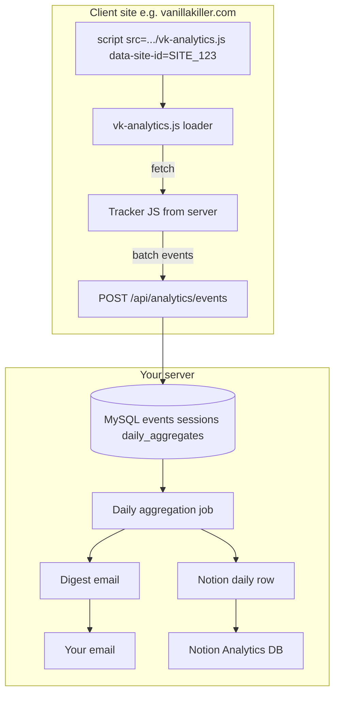

# Vanilla Killer Portable Analytics Layer (v1) – Implementation Plan

## 1. High-level system design

- **Client**: One script tag loads `vk-analytics.js` (loader). Loader fetches the latest tracker script from your server, injects it, and passes `data-site-id`. Tracker generates session/visitor IDs, attaches listeners (click, scroll, form open/submit, video, cookie banner), batches events, and POSTs to your API.
- **Server**: Express route receives event batches, validates `site_id`, writes to MySQL. Daily job at 00:05 UK aggregates by UK calendar day, sends digest email, and creates one row per site per day in a dedicated Notion database.

Existing pieces: [server.js](server.js), [server/config.js](server/config.js), [server/lib/notion-vkcrm.js](server/lib/notion-vkcrm.js). New: analytics routes, MySQL, tracker endpoint, aggregation script, email, Notion Analytics Daily DB.

---

## 2. Recommended tech stack

- **DB**: MySQL 8 (as requested).
- **Server**: Existing Node + Express; add analytics routes and static route for tracker.
- **Tracker**: Vanilla JS, single file, minified to under ~30kb.
- **Scheduler**: cron at 00:05 UK (`5 0 * * *` with `TZ=Europe/London`).
- **Email**: Nodemailer + SMTP (existing or SendGrid/SES).
- **Notion**: Existing `@notionhq/client`; new database "VK Analytics Daily" for summary rows.

No dashboard in Phase 1.

---

## 3. Database schema

- **sites**: `id`, `site_id` (UNIQUE), `name`, `created_at`
- **visitors**: `id`, `site_id`, `visitor_id`, `first_seen_at`, `last_seen_at`; UNIQUE(site_id, visitor_id)
- **sessions**: `id`, `site_id`, `visitor_id`, `session_id`, `is_new_visitor`, `started_at`, `last_activity_at`, `ended_at`
- **events**: `id`, `site_id`, `session_id`, `visitor_id`, `event_type`, `occurred_at`, `page_url`, `referrer`, `utm_source`–`utm_content`, `metadata` (JSON). Indexes: (site_id, occurred_at), (site_id, session_id), (site_id, event_type)
- **daily_aggregates**: `id`, `site_id`, `date` (UK day), `unique_visits`, `total_visits`, `pct_new_visitors`, `linkedin_visits`, `email_visits`, `avg_time_on_site_sec`, `avg_scroll_depth_pct`, conversion counts and CVRs, `form_opens`/`form_submits`/`form_abandons`, `cookie_accepts`/`cookie_rejects`, `top_clicks_json`, funnel counts; UNIQUE(site_id, date)

---

## 4. API spec

- **GET /analytics/tracker.js?site_id=SITE_123**: Returns tracker JS; validate site_id (e.g. against DB).
- **POST /analytics/events**: Body `{ "site_id": "SITE_123", "events": [ { "event_type", "timestamp", "session_id", "visitor_id", "page_url", "referrer", "utm_*", "metadata" }, ... ] }`. Max 50 events per request, ~100kb body. Respond 204 or 200 with accepted count. Validate site_id, required fields, sanitise URLs/metadata. Rate limit (e.g. 120/min per IP).

---

## 5. JS tracking script structure

- **Loader (vk-analytics.js)**: Read `data-site-id` from script tag; fetch tracker from server with site_id; inject via script blob or eval. Pass siteId and baseUrl into tracker.
- **Tracker (served by GET /analytics/tracker.js)**: First-party cookies `vk_sid` (session, 30 min inactivity), `vk_vid` (visitor, 1 year); only set long-lived cookie after cookie consent (GDPR). In-memory queue; flush every 30s or 20 events or beforeunload (sendBeacon). Events: page_view, scroll (max % per session), click (selector + page, cap per page), video_play/video_progress (HTML5 + embed API where possible), popup_open, form_open, form_submit, form_abandon (timer + beforeunload), cookie_banner_shown/accept/reject. Send POST to /analytics/events with batched payload. Minify; target under 30kb.

---

## 6. Daily aggregation logic

- Run at 00:05 UK for "yesterday" (UK date).
- Per site and date: unique_visits (unique visitor_id), total_visits (sessions), new vs returning from session flags; referrer/UTM from first page_view; linkedin_visits / email_visits from referrer and UTM; avg time on site (session last_activity − start, cap at session boundary); avg scroll depth; conversion counts by form type (contact = book-a-call + website-review, WRV, LM per type); funnel landing → form_open → form_submit with drop-off %; top clicks; cookie accept/reject %. Upsert one row into `daily_aggregates` per (site_id, date).

---

## 7. Email digest template structure

- Header: Date (UK), Site name.
- Sections: Traffic (unique visits, returning %, LinkedIn, email); Conversion (overall/contact/WRV/LM CVRs, raw emails collected, new enquiries to follow up); Engagement (avg time on site, avg scroll, top clicks); Funnel (landing → open → submit, drop-off %).
- Send via Nodemailer; env: DIGEST_EMAIL_FROM, DIGEST_EMAIL_TO, SMTP_*.

---

## 8. Notion integration method

- New Notion database "VK Analytics Daily" with columns: Date, Site ID/name, Unique visits, Overall CVR, Contact CVR, WRV CVR, LM CVR, Avg time on site, LinkedIn visits, Email visits.
- New env: NOTION_ANALYTICS_DAILY_DATABASE_ID. Same NOTION_TOKEN. One row per (site_id, date) via `client.pages.create`. Idempotent by date + site.

---

## 9. Step-by-step implementation plan

1. Create MySQL DB and tables; add DB_*, NOTION_ANALYTICS_DAILY_DATABASE_ID, DIGEST_EMAIL_*, SMTP_* to config and .env.example; seed `sites` (e.g. SITE_VK2026 for vanillakiller.com).
2. Add POST /analytics/events and GET /analytics/tracker.js; MySQL insert/upsert for events, visitors, sessions; rate limit; mount under /vk2026/api/analytics.
3. Implement tracker.js (identity, queue, event handlers, batching) and loader vk-analytics.js; minify tracker.
4. Add script tag to index.html; ensure form_open/form_submit/form_abandon and cookie events are emitted (from main.js or tracker heuristics).
5. Script `scripts/analytics-daily.js` (default: yesterday UK): for each site with events, compute and upsert daily_aggregates.
6. In same script: build digest from daily_aggregates and send email via Nodemailer.
7. In same script: create Notion row per site/date in Analytics Daily database.
8. Cron: `5 0 * * * TZ=Europe/London node /path/to/scripts/analytics-daily.js`.
9. Manual test: load site, trigger events, check DB and digest/Notion; optional unit tests for aggregation and API.
10. Document: ANALYTICS.md or README section for adding sites, env vars, cron.

---

## 10. Security and GDPR considerations

- **Security**: Validate/sanitise inputs; allowlist event_type; rate limit; parameterised SQL; CORS to allowed origins.
- **Abuse**: site_id is public; rate limits and per-site caps limit spoofing; optional API key later.
- **GDPR**: Set long-lived visitor cookie only after cookie consent; without consent use session-only or no persistent ID. Document analytics in privacy policy; retention (e.g. events 13 months). Avoid storing PII in events; "emails collected" for digest can come from Mailchimp/Notion.

---

## Open design questions – proposed solutions

1. **Time on site**: Session last_activity − start; cap at session boundary (30 min); ignore single-page <5s.
2. **Form abandonment**: Timer (e.g. 5 min) after form_open; cancel on form_submit; on timer or beforeunload send form_abandon (one per form per session).
3. **Video progress**: HTML5 timeupdate + ended; embedded use YouTube/Vimeo API where possible.
4. **Returning visitors + GDPR**: First-party cookie vk_vid only after consent; 1-year expiry; without consent session-only.
5. **Aggregation**: Single script run by cron; process yesterday; one transaction per site.
6. **Batch vs real-time**: Batch client-side (30s or 20 events or beforeunload); server writes events immediately.
7. **Abuse**: Rate limit, validate site_id, cap events per session/minute.
8. **Scale (10+ clients)**: Single DB with site_id indexes; aggregation is per-site; add read replica or shard later if needed.
